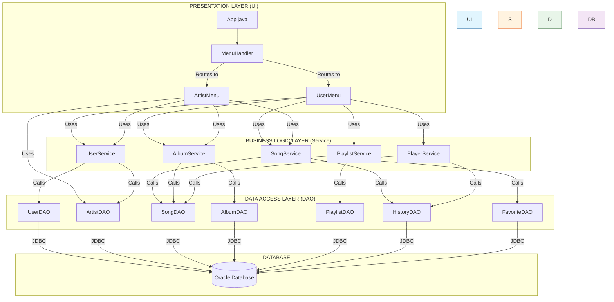
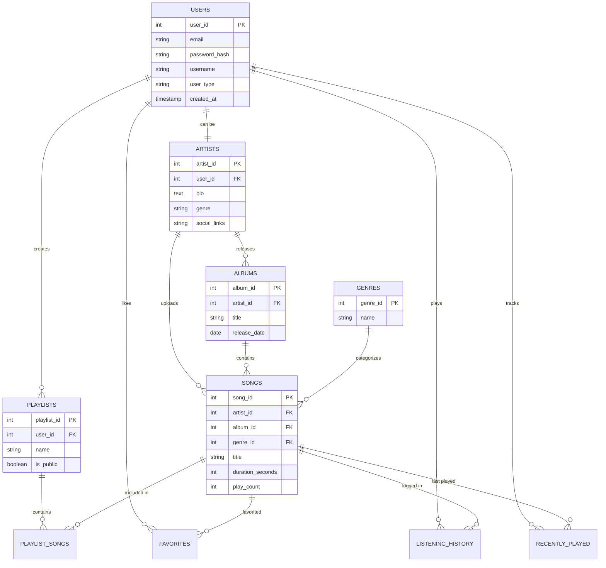

# RevPlay - System Architecture & Database Design

This document details the layered architecture and database relationships of the RevPlay Music Streaming Console Application.

## 🏛️ Application Architecture

RevPlay follows a standard **Tiered Architecture** to ensure modularity, scalability, and maintainability.

### Architecture Diagram

### Component Breakdown

1.  **Presentation Layer (UI)**:
    *   **`App.java`**: The entry point of the application.
    *   **`MenuHandler.java`**: Directs traffic, handles initial login/registration flow.
    *   **`UserMenu.java`**: Main interface for Listeners (Browsing, Playing, Playlists).
    *   **`ArtistMenu.java`**: Main interface for Artists (Uploads, Analytics, Profile).

2.  **Business Logic Layer (Service)**:
    *   **`UserService`**: Handles authentication, registration, and user profile logic.
    *   **`SongService`**: Manages song retrieval, searching, and favorites.
    *   **`PlaylistService`**: Logic for creating and modifying playlists.
    *   **`PlayerService`**: Simulates the music playback engine (Queue, Play/Pause, Threading).
    *   **`AlbumService`**: Manages album creation and song association.

3.  **Data Access Layer (DAO)**:
    *   Responsible for all direct interactions with the Oracle Database.
    *   Uses JDBC `PreparedStatement` for secure SQL execution.
    *   Maps `ResultSet` rows to Model objects.

4.  **Model Layer** (Not shown in diagram for simplicity):
    *   POJOs representing database entities: `User`, `Artist`, `Song`, `Album`, `Playlist`.

---

## 🗄️ Entity Relationship Diagram (ERD)

The database schema is designed to support users, artists, content management, and social features.

### Key Relationships
*   **Users vs Artists**: A User can upgrade to become an Artist (One-to-One).
*   **Playlists & Songs**: A Many-to-Many relationship resolved via the `PLAYLIST_SONGS` junction table, allowing songs to be in multiple playlists and playlists to have multiple songs.
*   **User Interactions**:
    *   **Favorites**: Many-to-Many between Users and Songs.
    *   **History**: Logs every play event (User -> Song).
    *   **Recently Played**: Keeps track of the last time a user played a specific song (Upsert logic).

### 6. Thread Safety & Concurrency
The **PlayerService** operates in a multi-threaded environment. To ensure stability:
- **Concurrent Collections**: Internal song queues use `CopyOnWriteArrayList` to prevent race conditions during simultaneous user interactions.
- **Volatile State**: Playback flags (`isPlaying`, `silentMode`) are marked as `volatile` to ensure immediate visibility across UI and Player threads.
- **Controlled Interruption**: Uses `thread.interrupt()` for deterministic stopping and cleanup of audio simulations.

### 7. Testing Architecture
RevPlay employs a **Hybrid Testing Strategy**:
- **Unit Layer (H2 DB)**: High-speed, in-memory isolation for testing business logic and DAO mappings without side effects.
- **Integration Layer (Oracle DB)**: Verifies real-world connectivity, Oracle-specific SQL functionality (like `DBMS_RANDOM`), and complex integrity constraints.
- **Feature Suites**: Tests are categorized into 9 distinct domains (Security, Concurrency, etc.) for granular quality assurance.

---
*Last Updated: February 2026*