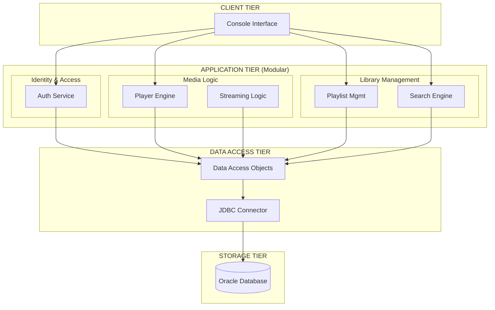
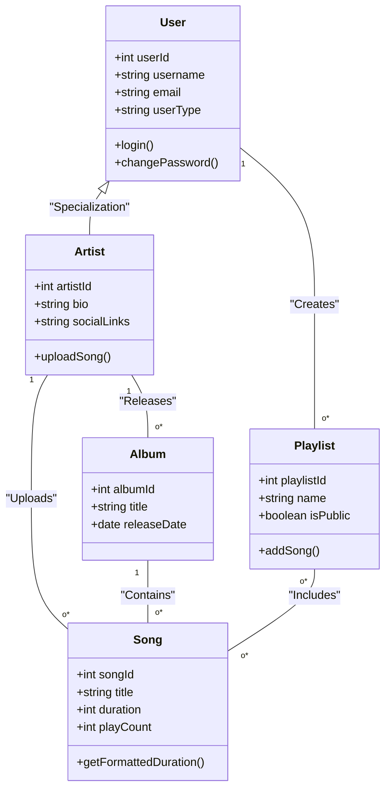
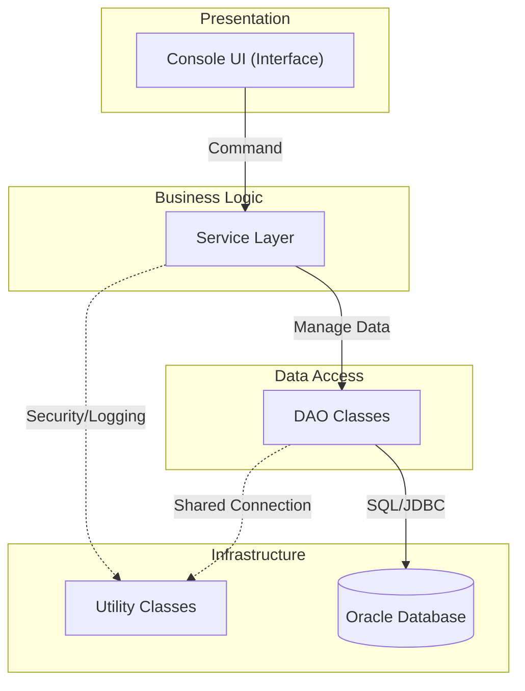
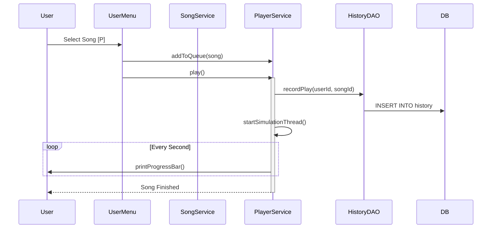
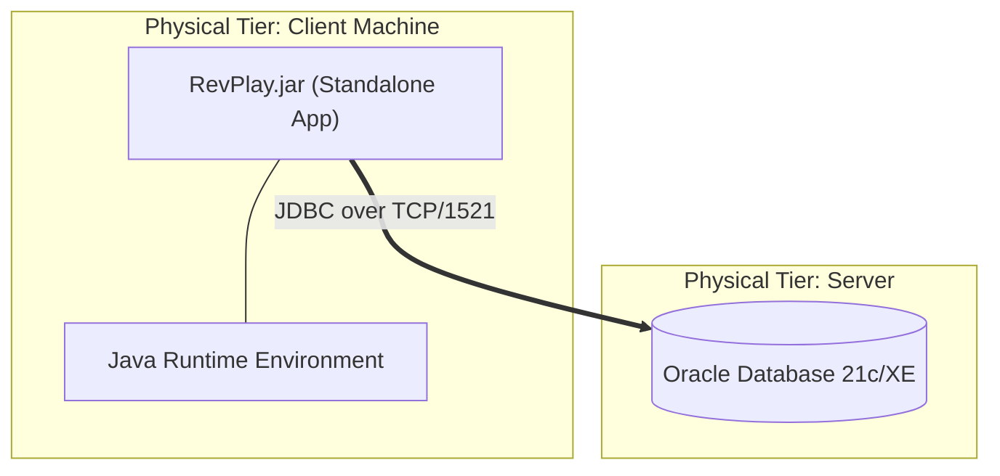

# RevPlay - Detailed System Design Specification

This document provides a deep-dive into the technical design, architectural patterns, and security mechanisms of the RevPlay Music Application.

---

## 🏗️ 1. Modular & Layered Architecture

RevPlay is designed using a **4-Tier Modular Architecture**. This separation of concerns ensures that the UI logic, business rules, and data persistence layers remain independent.

---

## 📂 2. Modular Design Explanation

The system is organized into distinct packages, each representing a logical module:

| Module | Package | Responsibility |
|:---|:---|:---|
| **Identity** | `com.revplay.service.UserService` | User lifecycle, authentication, and role management. |
| **Media Player** | `com.revplay.service.PlayerService` | Real-time simulation, queue handling, and background threading. |
| **Data Factory** | `com.revplay.dao` | Abstraction of SQL logic using the DAO pattern to prevent DB leakage into services. |
| **Domain Models** | `com.revplay.model` | Stateless POJOs representing the core business entities. |
| **Utilities** | `com.revplay.util` | Cross-cutting concerns like DB connection pooling and password security. |

---

## 📊 3. Class Diagram

The following diagram illustrates the relationships between the core model classes.

---

## 🧩 4. Component Diagram

Visualizes the physical organization and dependencies of the system components.

---

## 🔄 5. Sequence Diagram: Playing a Song

This diagram shows the interaction flow when a user selects a song to play.

---

## 🛡️ 6. Security Architecture

RevPlay implements a multi-layered security strategy:

1.  **Authentication Security**:
    - Passwords are never stored in plain text.
    - Uses **SHA-256 Hashing with dynamic Salt** (unique per user) to prevent rainbow table attacks.
2.  **Data Persistence Security**:
    - **Parameterized Queries**: Every database call uses `PreparedStatement` to eliminate **SQL Injection** risks.
    - **Principle of Least Privilege**: DAO methods are scoped to specific tables.
3.  **Input Validation**:
    - Centralized `InputValidator` checks email formats, username patterns, and password complexity.

---

## 🚀 7. Deployment Architecture

The application is deployed as a standalone JAR on a client machine, connecting to a centralized Oracle Database.

- **Client**: Any OS with JRE 17+ installed.
- **Server**: Centralized Oracle DB hosting user data and song metadata.
- **Network**: Standard TCP/IP connection via JDBC thin driver.